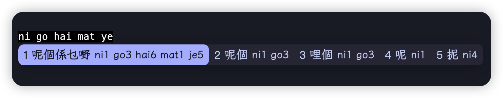

# Catppuccin Theme for Fcitx5-macOS

## Introduction

A clean and simple theme ported from the `fcitx5-catppuccin` Mocha theme.

## Preview

Here is a preview of the theme.

## Installation

1. Download the `catppuccin` folder from this repository.
2. Import `catppuccin.conf` via `Theme Manager -> Basic`.
3. Install the `LXGW WenKai` font, or configure the theme to use any other font you prefer.
4. Enjoy!

## Credits

- Original theme: [fcitx5-catppuccin](https://github.com/catppuccin/fcitx5) by **Catppuccin**
- Font: [LXGW WenKai](https://github.com/lxgw/LxgwWenKai) by **LxgwWenKai**

## License

Distributed under the **MIT License**.

Copyright (c) 2026-present [CircuitX](https://github.com/mc-all)
Based on [fcitx5-catppuccin](https://github.com/catppuccin/fcitx5), Copyright (c) 2021-present Catppuccin
